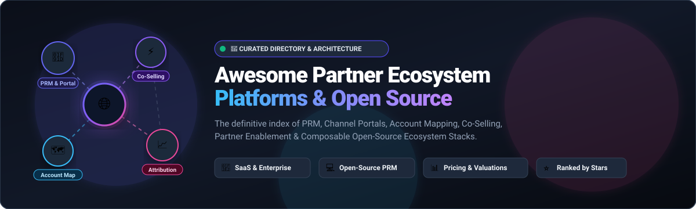

# Awesome-Partner-Ecosystem-Platform

<div align="center">

<a href="https://github.com/ishandutta2007/Awesome-Awesome-Awesome"></a>
<a href="https://discord.gg/jc4xtF58Ve"></a>
<a href="https://github.com/ishandutta2007/Awesome-Partner-Ecosystem-Platform/stargazers"></a>
<a href="https://github.com/ishandutta2007/Awesome-Partner-Ecosystem-Platform/network/members"></a>
<a href="https://github.com/ishandutta2007/Awesome-Partner-Ecosystem-Platform/issues"></a>
<a href="https://github.com/ishandutta2007/Awesome-Partner-Ecosystem-Platform/blob/main/LICENSE"></a>
<a href="https://github.com/ishandutta2007"></a>

<br/><br/>



# 🌐 Top Partner Ecosystem Platform Landscape & Architecture

**Curated Index of SaaS Products & Open-Source GitHub Projects**  
*Focused on Partner Relationship Management (PRM), Partner Portals, Channel Management, Ecosystem Mapping, Co-Selling, Partner Enablement & Partner Revenue*

[](https://github.com/ishandutta2007/Awesome-Partner-Ecosystem-Platform/pulls)
[](https://github.com/ishandutta2007/Awesome-Partner-Ecosystem-Platform/graphs/commit-activity)
[](https://github.com/ishandutta2007/Awesome-Awesome-Awesome)

</div>

---

## 📖 Overview

This repository tracks notable **SaaS/hosted platforms** and **open-source projects** for **Partner Ecosystem Management (PRM)**. Modern B2B software companies leverage partner ecosystems to drive co-selling, increase retention, source new pipeline, and accelerate revenue through channel partners, resellers, system integrators (SIs), managed service providers (MSPs), independent software vendors (ISVs), and affiliate networks.

These tools empower organizations to:
- 🤝 **Recruit, onboard, and train** channel partners with structured LMS & enablement portals.
- 🗺️ **Map accounts securely** to identify customer and prospect overlaps across partner networks without exposing raw data.
- ⚡ **Streamline co-selling & deal registration** with CRM bi-directional sync (Salesforce, HubSpot, Microsoft Dynamics 365).
- 💰 **Automate partner payouts, MDF (Marketing Development Funds), and multi-tier commissions**.
- 📊 **Track influenced pipeline and partner revenue attribution** with robust analytics.

---

## 📑 Table of Contents

- [🏢 SaaS & Hosted Platforms](#-saashosted-platforms)
- [💻 Open-Source GitHub Projects](#-open-source-github-projects)
- [🧩 Composable Open-Source Architecture](#-composable-open-source-architecture)
- [📈 Star History](#-star-history)
- [🤝 How to Contribute](#-how-to-contribute)
- [⚖️ Disclaimer](#️-disclaimer)

---

## 🏢 SaaS/Hosted Platforms

The following SaaS partner ecosystem and PRM platforms are sorted by **Company Size (Market Cap / Valuation / Revenue)** in descending order:

| Platform | Focus / Core Capabilities | Company Size / Valuation | Starting Price | Free Tier / Free Trial Limits |
| :--- | :--- | :--- | :--- | :--- |
| **[Microsoft Dynamics 365 PRM](https://www.microsoft.com/dynamics-365)** | Partner onboarding, channel sales, deal registration & Power Pages partner portals | **~$3.60 Trillion** (Market Cap) | $65/user/month (Dynamics 365 Sales Pro) | 30-day free trial with full Dynamics 365 functionality |
| **[Salesforce PRM](https://www.salesforce.com/)** | Partner Cloud & Experience Cloud PRM for deal management, lead distribution & channel sales | **~$170 Billion** (Market Cap) | $25/member/month (Partner Cloud PRM) | 30-day free trial of Salesforce Sales & Partner Cloud |
| **[HubSpot Partner Ecosystem](https://www.hubspot.com/)** | Solutions Partner program, deal registration, agency workflows & Operations Hub CRM data sync | **~$12 Billion** (Market Cap) | $15/seat/month (Starter tier; Free CRM available) | **Free forever plan**: Capped at 1,000 contacts, 2 users, 1 deal pipeline, and 10 custom properties |
| **[impact.com](https://impact.com/)** | Partnership management for affiliates, creators, influencers, and B2B referral partners | **~$1.5 Billion** (Valuation) | $30/month (Starter tier + 2.5–3% partner revenue fee) | 30-day risk-free trial on Starter; Free forever for creators/publishers |
| **[Everflow](https://everflow.io/)** | Partner marketing, performance tracking, attribution, payout automation & anti-fraud | **~$300 Million+** (Valuation) | $750/month (Core tier) | No free plan; Custom 14-day guided proof-of-concept trial via demo |
| **[Crossbeam](https://www.crossbeam.com/)** | Account mapping, partner data overlap, ecosystem intelligence & co-selling workflows | **~$450 Million+** (Valuation post-merger) | $4,800/year ($400/mo billed annually) | **Free forever plan (Explorer)**: Up to 50 partner records, 3 user seats, and single-partner mapping |
| **[Reveal](https://www.reveal.co/)** | Nearbound intelligence, account mapping & co-selling (merged with Crossbeam) | **~$150 Million+** (Combined with Crossbeam) | $4,800/year (Integrated Crossbeam platform) | **Free forever plan**: Up to 50 records, 3 user seats, standard populations |
| **[PartnerStack](https://partnerstack.com/)** | PRM & ecosystem platform for affiliates, referrals, resellers & co-selling (AppDirect) | **~$150 Million+** (Acquired by AppDirect) | $500/month (Launch tier + commission processing fee) | **Free plan (Spark)**: $0/mo subscription with 10% fee on partner payouts |
| **[Impartner](https://impartner.com/)** | Enterprise PRM, deal registration, partner portals, TCMA & channel enablement | **~$150 Million+** (Growth equity funding) | $2,000/month (Emerge package) | 30-day free trial on Emerge package (no permanent free tier) |
| **[Zift Solutions (Unifyr)](https://ziftsolutions.com/)** | Enterprise PRM, channel marketing automation (TCMA), MDF & deal registration | **~$100 Million+** (Investcorp funded) | $1,500/month (Base program) | No free plan; Guided demo with sandbox environment upon qualification |
| **[Allbound (Channelscaler)](https://www.allbound.com/)** | PRM and partner enablement platform for onboarding, deal registration & collaboration | **~$50 Million+** (Invictus Growth) | $3,495/month (Essentials tier) | No free plan/trial; Live demonstration with proof of concept |
| **[Mindmatrix (Bridge)](https://www.mindmatrix.net/)** | Unified PRM, partner enablement, marketing automation & channel sales readiness | **~$20 Million+** (ARR) | $499/month (Base plan) | 14-day free trial with full platform access |
| **[Partnerize](https://partnerize.com/)** | Partnership management and affiliate performance marketing automation | **~$20 Million+** (ARR) | $2,000/month (Platform license base) | No free plan; Customized demo environment provided upon request |
| **[TUNE](https://www.tune.com/)** | Partner marketing, performance tracking, attribution & payout management | **~$20 Million+** (ARR) | $499/month (Essential network tier) | 14-day free trial on standard network package |
| **[Channeltivity](https://www.channeltivity.com/)** | Pure-play PRM platform providing partner portals, deal registration, MDF & training | **~$15 Million** (ARR) | $1,399/month (Standard PRM edition) | No free plan; Interactive sandbox demo environment available |
| **[SalesScreen](https://www.salesscreen.com/)** | Partner sales gamification, channel incentive programs & performance tracking | **~$15 Million** (ARR) | $30/user/month (Scale tier, min. 10 users) | 30-day free trial with full feature access (no credit card required) |
| **[Channel Mechanics (Channelscaler)](https://www.channelmechanics.com/)** | Channel program automation, incentive management, pricing & rebate workflows | **~$12 Million** (ARR) | $4,166/month ($50k/year per automated module) | No free plan; Custom enterprise proof of concept upon demo |
| **[Magentrix](https://www.magentrix.com/)** | PRM and partner portal platform for deal registration, training, content & incentives | **~$10 Million** (ARR) | $1,500/month (PRM Essential tier for 500 users) | 15-day free trial available for qualified partner programs |
| **[Channel.io](https://channel.io/)** | Customer & partner communication platform with integrated CRM and live chat | **~$10 Million** (ARR) | $30/month (Early Stage plan based on active profiles) | 14-day free trial with unrestricted access to chat & CRM modules |
| **[Kademi](https://kademi.co/)** | Partner enablement, LMS, partner portals & channel engagement automation | **~$8 Million** (ARR) | $850/month (Base portal & LMS edition) | 30-day sandbox trial for select pre-configured solutions |
| **[PartnerPortal.io](https://partnerportal.io/)** | Branded self-service partner portal for deal registration and partner resource hub | **~$5 Million** (ARR) | $249/month (Professional tier) | **Free forever plan**: Up to 5 partners, 10 leads, 10 resources, 1 team member |
| **[PartnerFleet](https://partnerfleet.com/)** | Ecosystem marketplace platform for app directories, partner listings & co-marketing | **~$3 Million** (ARR) | $500/month (Core Marketplace module) | No free plan; Interactive preview and demo environment provided |
| **[ChannelXperts](https://www.channelxperts.com/)** | Channel and PRM platform for onboarding, certification & partner operations | **~$2 Million** (ARR) | $299/month (ChannelPRM starter package) | 30-day free trial on ChannelPRM package |
| **[Ecosystem.ai](https://www.ecosystem.ai/)** | AI-driven partner ecosystem platform for partner discovery & real-time interaction | **~$2 Million** (ARR) | $1,000/month (AWS Marketplace deployment entry) | 14-day free trial through AWS Marketplace listing |
| **[PartnerPortal by Channeltivity](https://www.channeltivity.com/channel-marketing/partner-portal/)** | Dedicated branded self-service partner portal with deal registration & dashboards | **~$1.5 Million** (ARR) | $1,399/month (Included in Channeltivity base) | No free plan; Product tour and sandbox demo upon request |
| **[Channelo](https://channelo.tech/)** | Modern lightweight PRM for resellers, MSPs, SIs, ISVs with deal registration & MDF | **~$1 Million** (ARR) | ₹2,999/month (~$36/month, no per-seat charges) | 14-day free trial with full portal access |

---

## 💻 Open-Source GitHub Projects

The following open-source projects provide dedicated PRM/referral tooling or core composable building blocks (CRM, auth, headless commerce, workflows, analytics) for building custom partner ecosystems. Repositories are sorted by **GitHub Star Count** in descending order:

| Open-Source Project | Stars & Community | Description / Ecosystem Role | Tech Stack |
| :--- | :--- | :--- | :--- |
| **[n8n](https://github.com/n8n-io/n8n)** | [](https://github.com/n8n-io/n8n/stargazers) | Fair-code workflow automation tool connecting CRM, partner portals, deal webhooks, and Slack/Teams alerts. | TypeScript, Node.js |
| **[FastAPI](https://github.com/fastapi/fastapi)** | [](https://github.com/fastapi/fastapi/stargazers) | High-performance Python web framework for building fast, async PRM REST APIs, webhooks, and account-mapping microservices. | Python |
| **[Supabase](https://github.com/supabase/supabase)** | [](https://github.com/supabase/supabase/stargazers) | Open-source Firebase alternative providing PostgreSQL, real-time subscriptions, Row Level Security (RLS), and authentication for partner portals. | TypeScript, PostgreSQL |
| **[Django](https://github.com/django/django)** | [](https://github.com/django/django/stargazers) | High-level Python web framework with built-in ORM, admin dashboard, and security for robust enterprise PRM platforms. | Python |
| **[Strapi](https://github.com/strapi/strapi)** | [](https://github.com/strapi/strapi/stargazers) | Leading open-source headless CMS for managing partner documentation, marketing collateral, co-branded assets, and knowledge bases. | JavaScript, TypeScript |
| **[NocoDB](https://github.com/nocodb/nocodb)** | [](https://github.com/nocodb/nocodb/stargazers) | Open-source Airtable alternative that turns any SQL database into a smart spreadsheet for partner directories and deal tracking. | TypeScript, Node.js |
| **[Apache Superset](https://github.com/apache/superset)** | [](https://github.com/apache/superset/stargazers) | Enterprise-grade business intelligence and data visualization platform for self-hosted partner revenue & attribution dashboards. | Python, TypeScript |
| **[Appwrite](https://github.com/appwrite/appwrite)** | [](https://github.com/appwrite/appwrite/stargazers) | Secure end-to-end backend server for web and mobile partner portals with built-in auth, database, and storage. | Dart, TypeScript |
| **[Twenty](https://github.com/twentyhq/twenty)** | [](https://github.com/twentyhq/twenty/stargazers) | Modern open-source CRM with extensible data models, custom objects, and GraphQL APIs suitable for managing partner pipelines. | TypeScript, React |
| **[Odoo](https://github.com/odoo/odoo)** | [](https://github.com/odoo/odoo/stargazers) | Complete open-source business suite with CRM, sales pipeline, reseller portal, commission calculations, and invoicing. | Python, JavaScript |
| **[Metabase](https://github.com/metabase/metabase)** | [](https://github.com/metabase/metabase/stargazers) | Intuitive open-source BI and embedded analytics platform for partner-sourced pipeline, commissions, and KPIs. | Clojure, TypeScript |
| **[Cal.com](https://github.com/calcom/cal.com)** | [](https://github.com/calcom/cal.com/stargazers) | Open-source scheduling infrastructure for embedding partner onboarding calls, co-sell meetings, and certification sessions. | TypeScript, Next.js |
| **[ERPNext](https://github.com/frappe/erpnext)** | [](https://github.com/frappe/erpnext/stargazers) | Open-source ERP featuring integrated CRM, supplier/distributor management, commissions, and accounting for channel operations. | Python, JavaScript |
| **[PostHog](https://github.com/PostHog/posthog)** | [](https://github.com/PostHog/posthog/stargazers) | Open-source product analytics, session recording, and feature flags to measure partner portal engagement and resource usage. | Python, TypeScript |
| **[Directus](https://github.com/directus/directus)** | [](https://github.com/directus/directus/stargazers) | Real-time REST & GraphQL data engine for instant custom partner database schemas, RBAC permissions, and file management. | TypeScript, Vue |
| **[Keycloak](https://github.com/keycloak/keycloak)** | [](https://github.com/keycloak/keycloak/stargazers) | Enterprise identity and access management providing SSO, OpenID Connect/SAML, multi-tenancy, and RBAC for partner portals. | Java |
| **[Medusa](https://github.com/medusajs/medusa)** | [](https://github.com/medusajs/medusa/stargazers) | Open-source composable commerce engine for building B2B partner marketplaces, multi-vendor catalogs, and distributor ordering. | TypeScript, Node.js |
| **[Dub](https://github.com/dubinc/dub)** | [](https://github.com/dubinc/dub/stargazers) | Open-source link management and attribution platform for generating tracked referral links and conversion analytics. | TypeScript, Next.js |
| **[Saleor](https://github.com/saleor/saleor)** | [](https://github.com/saleor/saleor/stargazers) | Headless, GraphQL-first commerce platform supporting multi-channel distributor operations and partner catalog management. | Python, Django |
| **[Formbricks](https://github.com/formbricks/formbricks)** | [](https://github.com/formbricks/formbricks/stargazers) | Open-source survey and partner feedback suite for gathering partner satisfaction (NPS), deal qualification, and onboarding intake. | TypeScript, Next.js |
| **[Frappe Framework](https://github.com/frappe/frappe)** | [](https://github.com/frappe/frappe/stargazers) | Low-code Python web framework with built-in doc types, workflows, and permissions for rapid partner portal development. | Python, JavaScript |
| **[EspoCRM](https://github.com/espocrm/espocrm)** | [](https://github.com/espocrm/espocrm/stargazers) | Lightweight open-source CRM for tracking channel organizations, partner contacts, deal registrations, and lead routing. | PHP, JavaScript |
| **[SuiteCRM](https://github.com/salesagility/SuiteCRM)** | [](https://github.com/salesagility/SuiteCRM/stargazers) | Established open-source enterprise CRM offering deep customization for partner tiers, opportunities, and channel workflows. | PHP, JavaScript |
| **[Open-Mercato](https://github.com/open-mercato/open-mercato)** | [](https://github.com/open-mercato/open-mercato/stargazers) | Modular B2B commerce platform with dedicated partner portal authentication and reseller management modules. | TypeScript, React |
| **[Openship](https://github.com/openshiporg/openship)** | [](https://github.com/openshiporg/openship/stargazers) | Open-source commerce order-routing engine connecting distributed fulfillment and logistics partners. | JavaScript, Node.js |
| **[OpenLinker](https://github.com/openlinker-project/openlinker)** | [](https://github.com/openlinker-project/openlinker/stargazers) | Self-hosted commerce orchestration tool connecting multi-channel sales channels, inventory feeds, and partner marketplaces. | PHP, Symfony |
| **[PartnerHub](https://github.com/ezanelato/PartnerHub)** | [](https://github.com/ezanelato/PartnerHub/stargazers) | Dedicated open-source PRM and referral management app with Kanban deal tracking, partner dashboards, and KPI leaderboards. | TypeScript, Node.js |
| **[Partner-Flow-FE](https://github.com/RifkyA911/Partner-Flow-FE)** | [](https://github.com/RifkyA911/Partner-Flow-FE/stargazers) | Open-source referral partner frontend interface featuring multi-level referral tracking, analytics, and RBAC. | TypeScript, Next.js |
| **[Ally](https://github.com/beniyke/ally)** | [](https://github.com/beniyke/ally/stargazers) | Open-source partner and reseller network management tool for tiered commission calculation and pre-paid credit distribution. | PHP |
| **[Impact REST API](https://github.com/api-evangelist/impact)** | [](https://github.com/api-evangelist/impact/stargazers) | API definition & OpenAPI specification for building programmatic affiliate tracking, partner payout, and conversion services. | OpenAPI / YAML |

---

## 🧩 Composable Open-Source Architecture

There is a growing shift from monolithic enterprise PRM systems to **Composable Partner Ecosystem Architectures**. By combining specialized open-source building blocks, organizations can construct a tailor-made PRM stack without vendor lock-in or recurring per-seat penalties:

```
┌────────────────────────────────────────────────────────────────────────┐
│                        PARTNER EXPERIENCE LAYER                        │
│  Partner Portal (Next.js / Vue)  │  Resource Hub (Strapi)  │ LMS & Certs
└───────────────────────────────────┬────────────────────────────────────┘
                                    ▼
┌────────────────────────────────────────────────────────────────────────┐
│                        IDENTITY & SECURITY (IAM)                       │
│  Keycloak (SSO / OIDC / SAML)    │  Supabase Auth (RLS Multi-Tenancy)  │
└───────────────────────────────────┬────────────────────────────────────┘
                                    ▼
┌────────────────────────────────────────────────────────────────────────┐
│                        CORE PRM & CRM FOUNDATION                       │
│  Twenty / Odoo / SuiteCRM / EspoCRM (Deals, Pipeline, Tiers, Accounts) │
└───────────────────────────────────┬────────────────────────────────────┘
                                    ▼
┌────────────────────────────────────────────────────────────────────────┐
│                        INTEGRATION & AUTOMATION                        │
│  n8n (Webhooks & Workflows)      │  Dub (Attribution Links)            │
└───────────────────────────────────┬────────────────────────────────────┘
                                    ▼
┌────────────────────────────────────────────────────────────────────────┐
│                        ECOSYSTEM INTELLIGENCE                          │
│  Apache Superset / Metabase (Revenue Attribution, Sourced Pipeline)   │
└────────────────────────────────────────────────────────────────────────┘
```

---

## 📈 Star History

[](https://star-history.dera.page/#ishandutta2007/Awesome-Partner-Ecosystem-Platform&type=date&legend=top-left)

---

## 🤝 How to Contribute

We welcome community contributions! To add a new platform, update pricing, or expand open-source alternatives:

1. 🍴 **Fork the repository**.
2. 🌿 **Create a descriptive branch**: `git checkout -b add-my-platform`.
3. 📝 **Edit `README.md`**: Follow the existing table schema. For SaaS products, include company size, specific starting prices, and explicit free tier/trial limits. For open-source repos, include GitHub social badges linking to stargazers.
4. ✅ **Ensure accuracy**: Ensure official URLs and factual data.
5. 🚀 **Submit a Pull Request** with a brief explanation of the change.

---

## ⚖️ Disclaimer

- This is a **community-curated index** for informational and educational purposes. Inclusion does not imply endorsement.
- SaaS pricing, packaging tiers, and free trial terms are subject to change by respective vendors.
- Always review licensing, security, compliance (SOC 2, ISO 27001), and production readiness before deploying open-source components.
- Sensitive partner and customer data should be protected with appropriate encryption, access controls, and privacy standards.

---

<div align="center">

**Made with ❤️ for partnership leaders, channel managers, ecosystem engineers, and developers.**  
*Let's build more connected, open, and automated partner ecosystems.*

</div>
